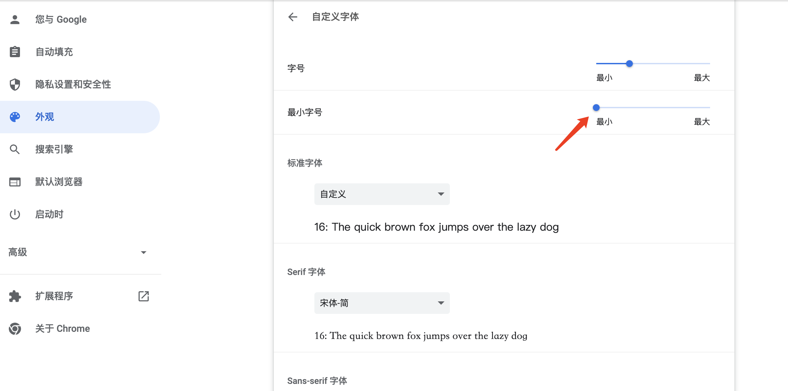

# tabbar    

设计稿： [Link](https://js.design/f/S2XzD5?p=S8rT46MRiL)

# keypoints     
## css   
1. 去掉li标签默认的圆点样式: list-style-type: none; 或者设置简写属性 list-style: none. [More](https://developer.mozilla.org/zh-CN/docs/Web/CSS/list-style);       

2. flex水平、垂直居中, 实际项目中用到最多的居中方式之一:        
```css
.demo {
  display: flex;
  align-items: center;
  justify-content: center;
}

```

3. cursor设置光标类型。当元素可交互，如元素可以点击，通常设置`cursor: pointer`， 光标会变成一个小手图标；另一个常用的情景是，当元素(如button)设置了disabled属性而变得不可点击时，通常要设置`cursor: not-allowed`， 光标会变成禁用的图标。这样可以更好的告知用户，按钮此刻不可点击。[More](https://developer.mozilla.org/zh-CN/docs/Web/CSS/cursor);      

4. font-size小于12px时，在chrome浏览器中表现仍未12px。 我们在使用chrome调试， 尤其时移动端应用时，会遇到字体小于12px的情景，但是这是在chrome中的表现仍是12px, 并不是设置的大小。这是因为chrome的默认最小字号是12px。我们只需要如下操作就可以显示任意字号：    
chrome设置 --> 外观 --> 自定义字体 --> 最小字号一栏拖到最左  即可。     
<br />
<div style="display: flex; justify-content: center;">
  
</div>      
<br />

## javascript    
1. [事件冒泡和捕获](https://zh.javascript.info/bubbling-and-capturing)
2. [事件委托](https://zh.javascript.info/event-delegations)
